# Binary Banner Builder

A web application for generating visual binary art patterns for LinkedIn banners, social media headers, and custom designs. Features a 6-step wizard interface, custom mask editor, and live LinkedIn profile preview.


---

## 📋 Table of Contents

- [Quick Start](#-quick-start)
- [Project Context](#-project-context)
- [Features](#-features)
- [User Guide](#-user-guide)
- [Wizard Workflow](#-wizard-workflow)
- [Technical Details](#-technical-details)
- [Tips &amp; Best Practices](#-tips--best-practices)
- [Troubleshooting](#-troubleshooting)
- [Future Enhancements](#-future-enhancements)

---

## 🚀 Quick Start

### Installation

**Option 1: Automated Setup (Recommended)**

```bash
# macOS/Linux
./start_server.sh

# Windows
start_server.bat
```

**Option 2: Manual Setup**

```bash
# Create and activate virtual environment
python3 -m venv .venv
source .venv/bin/activate  # macOS/Linux
# or
.venv\Scripts\activate     # Windows

# Install dependencies
pip install -r requirements.txt

# Start the server
python3 app.py
```

### First Banner in 2 Minutes

1. **Open** `http://localhost:5000` in your browser
2. **Step 0**: Read the about page, then click "Get Started"
3. **Step 1**: Select "LinkedIn Banner (1584×396)" preset, choose a mask (try "Skyline")
4. **Step 2**: Use mask editor tools (invert, threshold, brush) or click "Next" to continue
5. **Step 3**: Adjust grid settings (defaults work great)
6. **Step 4**: Click a text zone, add your text, save
7. **Step 5**: Review settings, click "Generate Banner"
8. **Download** your creation!

**🎉 You just created your first binary banner!**

---

## 💡 Project Context

### LinkedIn Cover Design for Technical Profiles

This tool was built to address a specific challenge: creating LinkedIn banners that signal technical expertise without being overly promotional. For engineers and data professionals, a cover image composed of binary digits (1s and 0s) provides a clean, technical aesthetic that communicates craft and systems thinking.

**Key design considerations:**

- **Minimal composition** - Binary texture provides visual interest without competing with profile content
- **Text integration** - Smart grid-snapping ensures custom text (taglines, quotes) aligns naturally with the binary pattern
- **Profile preview** - The LinkedIn preview feature helps avoid common layout issues (text clashing with avatar circle, headline overlap, mobile cropping)

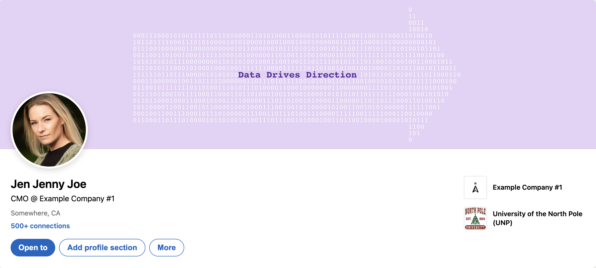

*Example: Custom banner rendered within the LinkedIn preview feature, showing how text integrates with profile elements*

### Beyond LinkedIn

While optimized for LinkedIn banners (1584×396), the system functions as a general binary art generator. Any black-and-white image can serve as a mask, translating visual imagery into a matrix of 1s and 0s. Use cases include:

- Social media headers
- Digital posters
- Experimental data visualizations
- Any composition where binary representation serves the concept

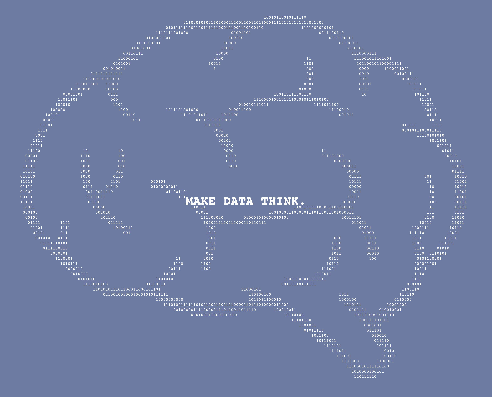

*Example: Non-LinkedIn banner demonstrating arbitrary binary art composition with custom text placement*

---

## ✨ Features

### 🎨 Visual Editor

- **Guided 6-step wizard** - Browser-based interface
- **Real-time previews** - Instant visual feedback
- **Drag-and-drop** mask upload
- **Interactive zone selector** - Visual text placement
- **Dynamic layout** - Adapts to canvas proportions

### 🖼️ Canvas & Masks

- **Preset sizes**: LinkedIn, Facebook, Twitter, Instagram, HD, 4K
- **Custom dimensions**: 100-5000px
- **5 built-in masks**: Arrow, Skyline, Border, Full, Triangles
- **Custom mask support**: Upload PNG/JPG/GIF/WebP
- **Advanced mask editor**: Threshold, brush tool, fit modes, invert option

### 🔢 Grid Customization

- **5 monospace fonts**: Courier, Menlo, Monaco, Consolas, JetBrains Mono
- **Font size**: 6-30px with real-time preview
- **Spacing controls**: Horizontal (-10 to 20px) and vertical (0-30px)
- **Font color**: Full color picker
- **Background color**: Unified across all previews
- **Bold option**: Emphasis for digits

### ✍️ Text Zones

- **9 flexible zones**: Top/Middle/Bottom × Left/Center/Right
- **Smart grid-snapping**: Text automatically aligns with binary digit rows
  - Small text blends inline with digits
  - Large text centers between rows
  - Creates cohesive, professional layouts
- **Per-zone customization**: Font size, color, alignment, bold, caps
- **Multiline support**: Natural line breaks
- **Bulk editing**: Apply settings to all zones at once
- **Visual preview**: See text placement on proportional grid

### ⚡ Advanced Settings

- **Resolution multiplier**: 1x-4x for super-sampling
- **Blur smoothing**: Toggle for crisp/soft edges
- **Clip threshold**: Control digit visibility (0.0-1.0) → Higher values hide more digits based on mask intensity

### 💼 LinkedIn Preview

- **Live preview rendering**: See exactly how your banner looks on a LinkedIn profile
- **Two modes**:
  - **Placeholder mode**: Uses default sample profile info (quick preview)
  - **Custom mode**: Use your actual LinkedIn profile details (realistic preview)
- **Customizable fields**:
  - Profile photo upload
  - Full name
  - Current position
  - Headline
  - Company
  - Location
  - Connection count
- **Smart sync**: Changes in modal or card automatically synchronized
- **State tracking**: Shows "Settings Saved" when preview is up-to-date
- **Profile integration**: Visualizes banner within actual LinkedIn profile context

---

## 📚 User Guide

### About Page (Step 0)

Initial landing page includes:

- **Welcome section** with project description
- **"Jump to..." navigation** with custom icons:
  - How It Works
  - View Example Gallery
  - Get Started
- **Step-by-step overview** (6 steps: 0-5)
- **Example gallery** with carousel and thumbnails
- **Fullscreen image viewer**

Click "Get Started" to begin the wizard!

**Screenshots:**

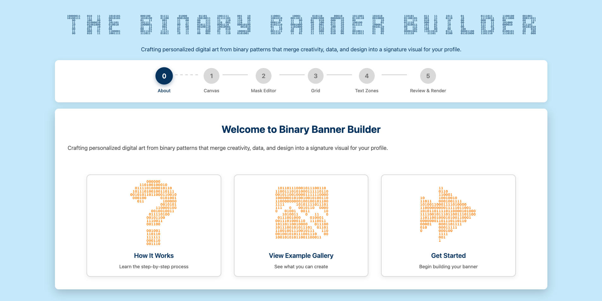
*Welcome section with navigation cards*

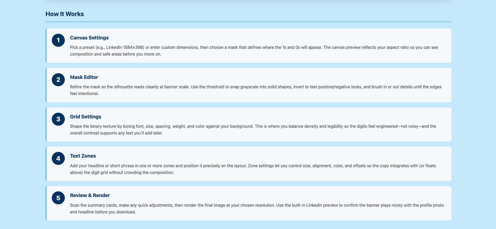
*Step-by-step overview of the workflow*

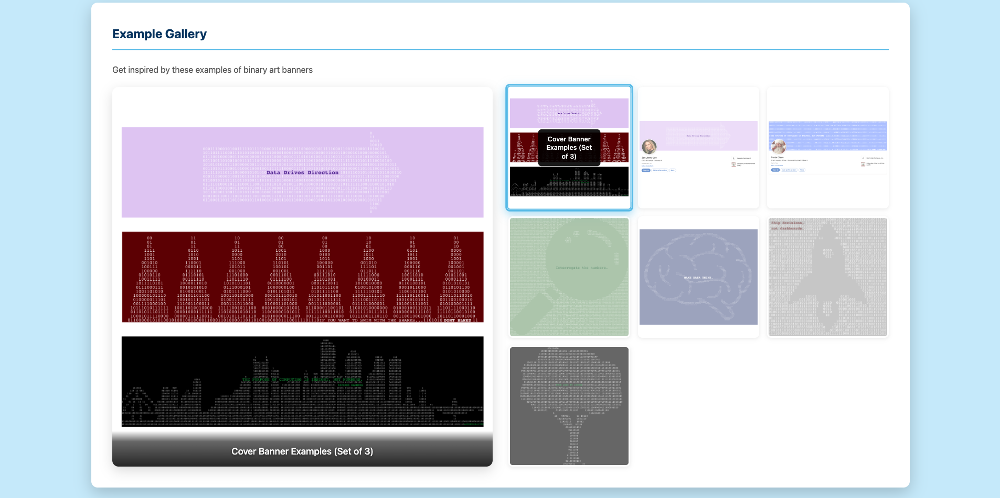
*Gallery carousel with example banners*

---

## 🧙 Wizard Workflow

### Step 1: Canvas Settings

**Configure your canvas:**

- Select preset size or enter custom dimensions
- Choose aspect ratio (automatic calculation shown)
- Mask selection:
  - **Default masks**: Arrow, Skyline, Binary Border, No Mask, Triangles
  - **Upload custom**: Your own PNG/JPG/GIF/WebP

**Real-time preview:**

- Proportional canvas shape displayed
- Dimensions and aspect ratio shown
- Mask thumbnail previewed

**Navigation:**

- Click "Next" to proceed to Step 2 (Mask Editor)

**Screenshot:**

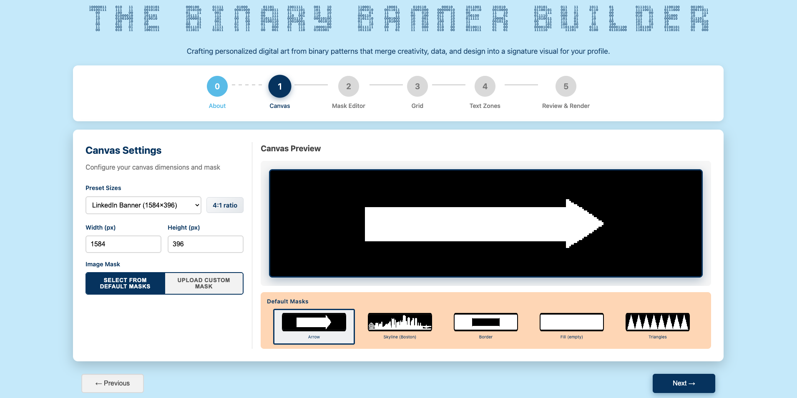
*Canvas dimensions and mask selection interface*

---

### Step 2: Mask Editor

**Always available** - Appears for both default and custom masks

**Why it's useful:**

- **Invert mask**: Completely flip white/black areas for opposite design
- **Customize defaults**: Paint on built-in masks to personalize them
- **Fine-tune custom uploads**: Perfect your own mask images
- **Experiment**: Try different looks before finalizing

**Tools available:**

#### Fit to Canvas

- **Contain**: Fit within (preserves aspect, may add bars)
- **Cover**: Fill canvas (preserves aspect, may crop)
- **Stretch**: Exact fit (may distort)

#### Threshold Slider

- Range: 0-255 (default: 128)
- Pixels above → White (digits visible)
- Pixels below → Black (digits hidden)
- Real-time preview

#### Brush Tool

- **Paint White**: Add visible areas
- **Paint Black**: Remove visible areas
- Brush size: 5-100px
- Click and drag to paint

#### Actions

- **Invert Mask**: Swap black/white areas instantly
- **Clear Brush Edits**: Remove manual painting
- **Reset to Original**: Undo all changes
- **Apply Changes**: Save and continue

**Tips:**

- Use threshold first for general shape
- Use brush for fine details
- Preview updates immediately
- All edits are saved automatically

**Screenshot:**

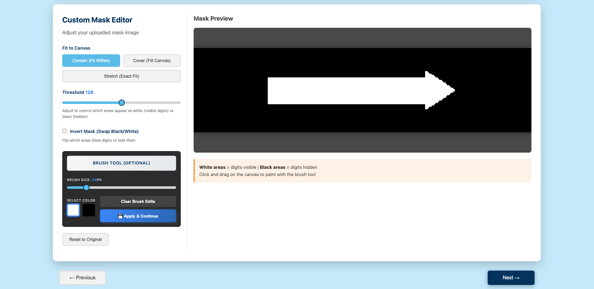
*Mask editor with threshold, brush, and invert controls*

---

### Step 3: Grid Settings

**Configure binary digit pattern:**

- **Font Family**: Choose from 5 monospace fonts
- **Font Size**: 6-30px (affects density)
- **Horizontal Spacing**: -10 to 20px (negative = tighter)
- **Vertical Spacing**: 0-30px
- **Bold Digits**: Toggle weight
- **Font Color**: Any hex color (default: white)
- **Background Color**: Canvas background (default: black)

**Preview feature:**

- Click "Update Grid Preview" to see full grid
- No mask applied - raw digit pattern
- Useful for testing spacing and density
- Preview updates with background color changes

**Tips:**

- Larger font = fewer digits (less dense)
- More spacing = more readable
- Test preview before continuing

**Screenshot:**

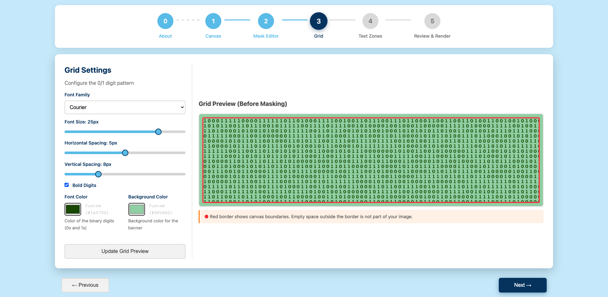
*Grid settings panel with font, spacing, and color controls*

---

### Step 4: Text Zones

**9-zone system:**

```
┌─────────────┬─────────────┬─────────────┐
│  Top Left   │ Top Center  │  Top Right  │
├─────────────┼─────────────┼─────────────┤
│ Middle Left │Middle Center│Middle Right │
├─────────────┼─────────────┼─────────────┤
│ Bottom Left │Bottom Center│Bottom Right │
└─────────────┴─────────────┴─────────────┘
```

**Zone grid features:**

- **Dynamic aspect ratio**: Matches your canvas proportions
- **Visual feedback**: Active zones highlighted
- **Dimension display**: Shows canvas size and ratio
- **Live preview**: See text placement on canvas-shaped grid
- **Grid-snapping**: Text intelligently aligns with binary digit rows
  - Matches digit font size → Text sits inline with digits
  - Larger than digits → Text centers between rows
  - Smaller than digits → Text aligns with row baseline
  - Multiline text → Each line independently positioned

**Per-zone configuration:**

- **Text**: Any content, multiline supported (press Enter)
- **Font Size**: 8-100px (defaults to grid font size)
- **Color**: Full color picker
- **Y Offset**: Vertical adjustment (-100 to 100px)
- **X Offset**: Horizontal adjustment (-100 to 100px)
- **Bold**: Toggle weight
- **Capitalize**: Auto-uppercase
- **Alignment**: Left, Center, Right (disabled for multiline)

**Bulk editing:**

- Click "Modify All Text Zones" (only enabled when zones exist)
- Select which settings to apply
- Apply to all zones at once

**Tips:**

- Default font size matches grid font size
- Zones adapt to canvas shape
- Use center zones for important content
- Save often (auto-saves on "Save" click)

**Screenshots:**

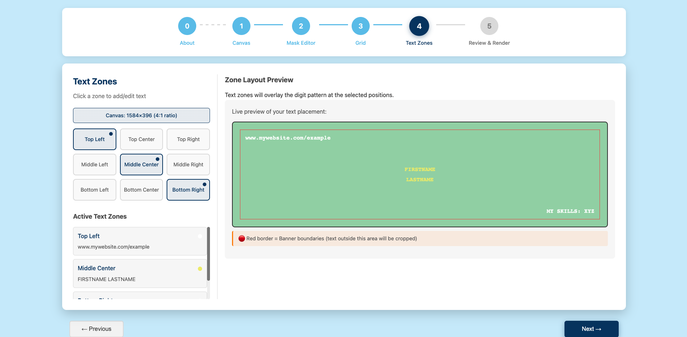
*9-zone grid with layout preview*

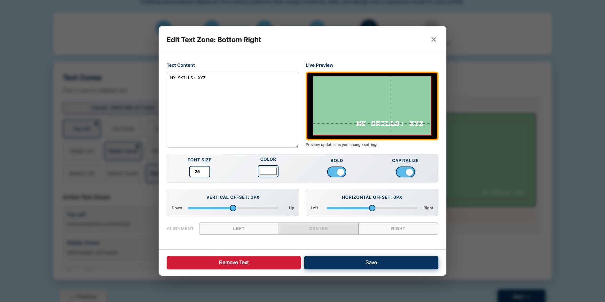
*Individual zone editor with font, color, and alignment controls*

---

### Step 5: Final Review & Render

**Summary cards** display all settings:

- Canvas Settings, Grid Settings, Active Text Zones
- Click "Edit" on any card to jump back and modify
- Settings preserved across navigation

**Advanced rendering options:**

- Resolution multiplier (1x/2x/4x)
- Blur smoothing toggle
- Clip threshold (0.0-1.0) → Controls which pixels render based on mask intensity (higher = fewer digits visible)

**LinkedIn Preview:**

- Toggle to enable custom profile mockup
- Upload profile photo and enter LinkedIn details (name, position, headline, company, location, connections)
- "View All Options" opens full editor modal
- Click "Apply Changes to Preview" to render banner within realistic LinkedIn profile context
- Useful for verifying banner works with profile photo and headline placement

**Generate & download:**

- Click "Generate Banner" (1-5 seconds)
- Preview appears below when ready
- Download PNG to computer

**Screenshots:**

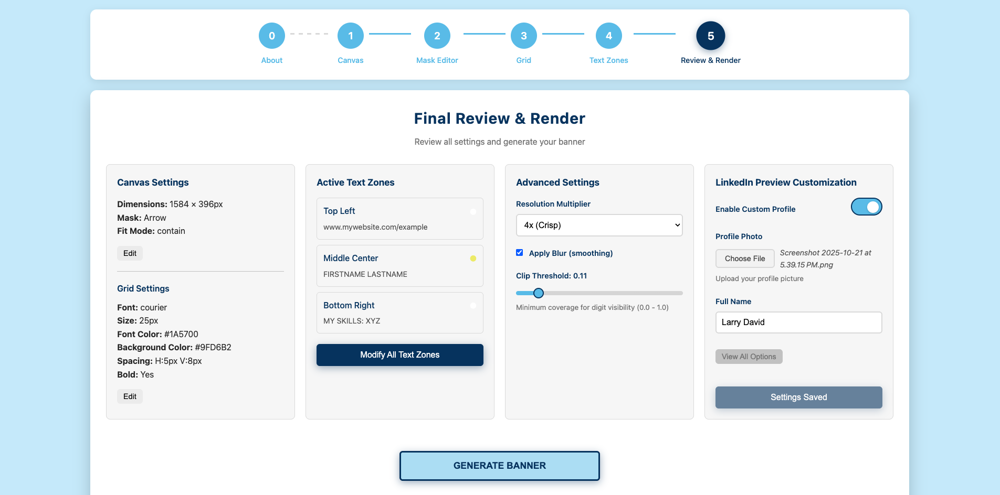
*Summary cards showing all configuration choices*

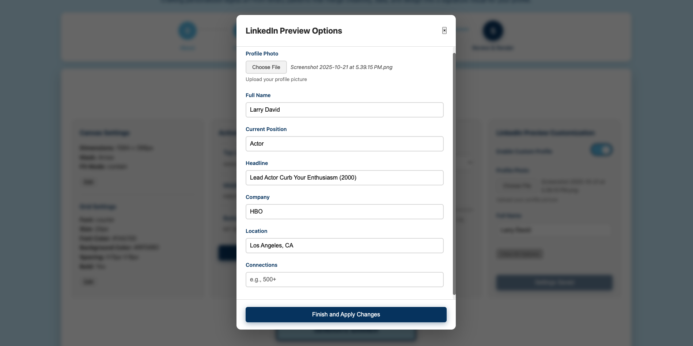
*LinkedIn preview customization panel*

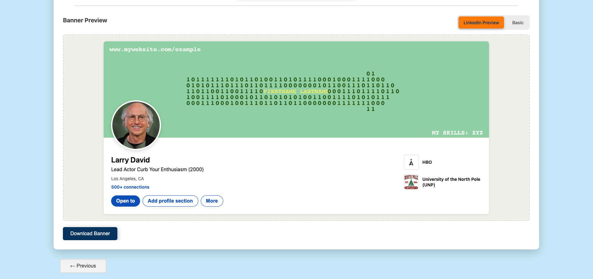
*Generated banner shown within LinkedIn profile mockup*

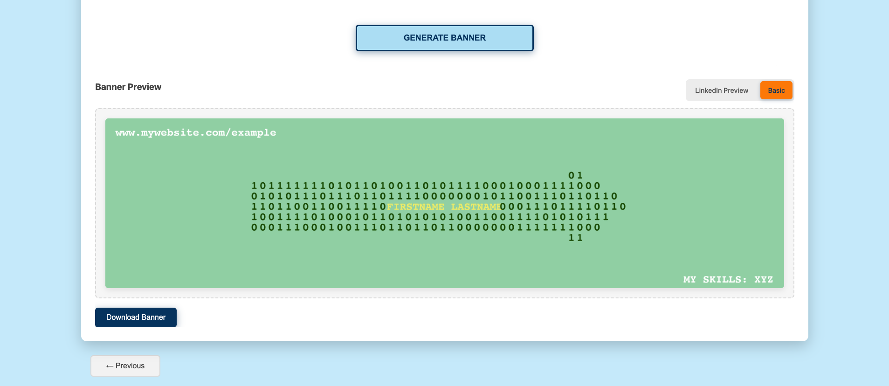
*Final rendered banner output*

---

## 🏗️ Technical Details

### Architecture

**Frontend:**

- **HTML5/CSS3**: Modern, responsive UI
- **Vanilla JavaScript**: No frameworks, lightweight
- **Canvas API**: Mask editing, previews
- **Wizard pattern**: Guided multi-step flow

**Backend:**

- **Flask**: Python web server
- **Pillow (PIL)**: Image processing
- **NumPy**: Efficient array operations
- **Base64 encoding**: Image transport

### File Structure

```
project_for_upload/
├── app.py                         # Flask server & routes
├── banner_renderer.py             # Core rendering engine
├── templates/
│   └── index.html                 # Main UI page
├── static/
│   ├── css/
│   │   └── styles.css             # All styling
│   ├── js/
│   │   └── app.js                 # Client-side logic
│   ├── custom_icons/              # Navigation icons
│   └── examples/                  # Gallery images
├── masks/                         # Built-in masks
├── uploads/                       # User uploads
├── outputs/                       # Generated banners
└── requirements.txt               # Python dependencies
```

### API Endpoints

| Route                     | Method | Purpose                                      |
| ------------------------- | ------ | -------------------------------------------- |
| `/`                     | GET    | Serve main UI                                |
| `/api/upload_mask`      | POST   | Handle mask uploads (full-res, no thumbnail) |
| `/api/save_edited_mask` | POST   | Save mask editor changes                     |
| `/api/preview_grid`     | POST   | Generate grid preview                        |
| `/api/render`           | POST   | Generate final banner                        |
| `/api/mask/<type>`      | GET    | Serve built-in masks                         |

### State Management

**Client-side state object:**

```javascript
state = {
    maskFilename: 'default',
    maskType: 'skyline',
    textZones: {},
    currentEditingZone: null,
    currentStep: 0,
    completedSteps: [0],
    maskEditor: {
        originalImage: null,
        currentImage: null,
        fitMode: 'stretch',
        threshold: 128,
        invert: false,
        hasUnsavedChanges: false,
        brushLayer: null,
        brushColor: 'white',
        brushSize: 20
    },
    linkedinSettingsSaved: true,
    currentBannerPreview: null
}
```

**State persistence:**

- All settings preserved across steps
- Text zones saved in memory
- Mask edits auto-saved on proceed
- No server-side sessions required

### Performance

**Optimizations:**

- Grid preview: 2x resolution (fast)
- Final render: 4x resolution (crisp)
- Base64 encoding: No temporary files
- Nearest neighbor scaling: Prevents blur
- Image smoothing disabled: Crisp pixels

**Rendering times:**

- Grid preview: ~1 second
- Final render: ~1-5 seconds (depends on resolution/size)
- Canvas preview: Instant (CSS-only)

### Browser Compatibility

- ✅ Chrome/Edge (v90+)
- ✅ Firefox (v88+)
- ✅ Safari (v15+)
- ⚠️ Mobile: Responsive but desktop recommended

---

## 📄 License

This project is licensed under the MIT License. Feel free to use, modify, and distribute.

---

## 🙏 Acknowledgments

- **Pillow**: Python Imaging Library
- **Flask**: Lightweight web framework
- **NumPy**: Efficient array operations
- **Monospace fonts**: Courier, Menlo, Monaco, Consolas, JetBrains Mono

---

**Version**: 2.0
**Last Updated**: 2025-10-21
**Author**: Andrew Sullivan
